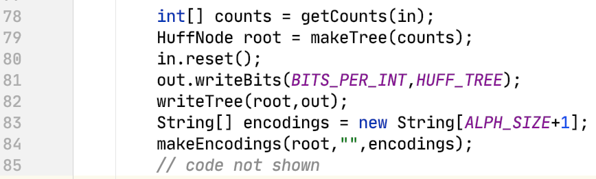
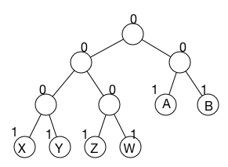

# Project 5: Huffman Coding/Compression

This is the directions document for Project 5 Huffman in CompSci 201 at Duke University, Spring 2023. [This document details the workflow](https://coursework.cs.duke.edu/cs-201-fall-22/p5-huffman#submitting-reflect-grading). for downloading the starter code for the project, updating your code on coursework using Git, and ultimately submitting to Gradescope for autograding.

## Project Introduction

There are many techniques used to compress digital data (that is, to represent it using less memory). This assignment covers Huffman Coding, which is used everywhere from zipping a folder to jpeg and mp3 encodings. You can optionally read more about the history of Huffman Coding and this project in the expandable section below.

<details>
<summary>Optional Background of Huffman</summary>
Huffman coding was invented by David Huffman while he was a graduate student at MIT in 1950 when given the option of a term paper or a final exam. For details, see [this 1991 Scientific American Article][Huffman Article]. In an autobiography Huffman had this to say about the epiphany that led to his invention of the coding method that bears his name:

"*-- but a week before the end of the term I seemed to have nothing to show for weeks of effort. I knew I'd better get busy fast, do the standard final, and forget the research problem. I remember, after breakfast that morning, throwing my research notes in the wastebasket. And at that very moment, I had a sense of sudden release, so that I could see a simple pattern in what I had been doing, that I hadn't been able to see at all until then. The result is the thing for which I'm probably best known: the Huffman Coding Procedure. I've had many breakthroughs since then, but never again all at once, like that. It was very exciting.*"

[The Wikipedia reference][Huffman Wikipedia] is extensive as is [this online material][Duke Huffman ] developed as one of the original [Nifty Assignments][Nifty Assignments]. Both jpeg and mp3 encodings use Huffman Coding as part of their compression algorithms. In this assignment you'll implement a complete program to compress and uncompress data using Huffman coding.

We first gave a Huffman coding assignment at Duke in Spring of 1994. Over the years many people have worked on creating the infrastructure for the bit-reading and -writing code (as we changed from C to C++ to Java at Duke) and the GUI that drives the Huffman assignment. It was one of the original so-called "nifty assignments" (see http://nifty.stanford.edu) in 1999. In Fall of 2018 we moved away from the GUI and using a simple main and the command-line. This was done for pragmatic and philosophical reasons.
</details>

### `BitInputStream` and `BitOutputStream` Classes

These two classes are provided to help in reading/writing bits in (un)compressed files. They extend the Java [InputStream](https://docs.oracle.com/javase/9/docs/api/java/io/InputStream.html) and [OutputStream](https://docs.oracle.com/javase/9/docs/api/java/io/OutputStream.html) classes, respectively. They function just like Scanner, except instead of reading in / writing out arbitrarily delimited “tokens”, they read/write a specified number of bits. Note that two consecutive calls to the `readBits` method will likely return different results since InputStream classes maintain an internal "cursor" or "pointer" to a spot in the stream from which to read -- and once read the bits won't be read again (unless the stream is reset).

The only methods you will need to interact with are the following:
1. *`int BitInputStream.readBits(int numBits)`*: This method reads from the source the specified number of bits and returns an integer. Since integers are 32-bit in Java, the parameter `numBits` must be between 1 and 32, inclusive. **It will return -1 if there are no more bits to read.**
2. `void BitInputStream.reset()`: This method repositions the “cursor” to the beginning of the input file.
3. `void BitOutputStream.writeBits(int numBits, int value)`: This method writes the least-significant `numBits` bits of the value to the output file.

## Part 1: Implementing `HuffProcessor.decompress`

You should begin programming by implementing `decompress` first before moving on to `compress`. You'll remove the code you're given intially in `HuffProcessor.decompress` and implement code to actually compress as described in this section. You **must remember to close the output file** before `decompress` returns. The call `out.close` is in the code you're given, be sure it's in the code you write as well.

There are four conceptual steps in decompressing a file that has been compressed using Huffman coding:
1. Read the 32-bit "magic" number as a check on whether the file is Huffman-coded (see lines 150-153 below)
2. Read the tree used to decompress, this is the same tree that was used to compress, i.e., was written during compression (helper method call on line 154 below).
3. Read the bits from the compressed file and use them to traverse root-to-leaf paths, writing leaf values to the output file. Stop when finding `PSEUDO_EOF` (hidden while loop on lines 156-174 below).
4. Close the output file (line 175 below).

### Reading the Tree (private HuffNode readTree)

Reading the tree using a helper method is required since reading the tree, stored using a pre-order traversal, is much simpler with recursion. You don't have to use the names or parameters described above, though you can.
In the 201 Huffman tree protocol, interior tree nodes are indicated by the single bit 0 and leaf nodes are indicated by the single bit 1. No values are written for internal nodes and a 9-bit value is written for a leaf node. 

### Reading Compressed Bits (while (true))

Once you've read the bit sequence representing the tree, you'll read the remaining bits from the `BitInputStream` representing the compressed file one bit at a time, traversing the tree from the root and going left or right depending on whether you read a zero or a one.

## Part 2: Implementing `HuffProcessor.compress`

There are five conceptual steps to compress a file using Huffman coding. You do not need to use helper methods for these steps, but for some steps helper methods are extremely useful and will facilitate debugging.

1. Determine the frequency of every eight-bit character/chunk in the file being compressed (see line 78 below).
2. From the frequencies, create the Huffman trie/tree used to create encodings (see line 79 below).
3. From the trie/tree, create the encodings for each eight-bit character chunk (see lines 83-84 below).
4. Write the magic number and the tree to the beginning/header of the compressed file (see lines 81-82 below).
5. Read the file again and write the encoding for each eight-bit chunk, followed by the encoding for PSEUDO_EOF, then close the file being written (not shown).

You won't need to throw exceptions for the steps outlined. A brief description of each step follows. More details can be found in the explanation of the Huffman algorithm in the [Huffman coding writeup](https://www.cs.duke.edu/csed/poop/huff/info/).

<div align="center">
  
</div>

### Determining Frequencies (private int[] getCounts)

Create an integer array that can store 256 values (use `ALPH_SIZE`). You'll read 8-bit characters/chunks, (using `BITS_PER_WORD` rather than 8), and use the read/8-bit value as an index into the array, incrementing the frequency. Conceptually this is a map from 8-bit chunk to frequency for that chunk, it's easy to use an array for this, mapping the index to the number of times the index occurs, e.g., `counts['a']` is the number of times 'a' occurs in the input file being compressed. The code you start with in compress (and decompress) illustrates how to read until the sentinel -1 is read to indicate there are no more bits in the input stream. 

### Making Huffman Trie/Tree (private HuffNode makeTree)

You'll use a greedy algorithm and a `PriorityQueue` of `HuffNode` objects to create the trie. Since `HuffNode` implements `Comparable` (using weight), the code you write will remove the minimal-weight nodes when `pq.remove()` is called as shown in the pseudocode included in the expandable section below.

<details>
<summary> Expand for makeTree pseudocode </summary>

``` java
PriorityQueue<HuffNode> pq = new PriorityQueue<>();
for(every index such that freq[index] > 0) {
    pq.add(new HuffNode(index,freq[index],null,null));
}
pq.add(new HuffNode(PSEUDO_EOF,1,null,null)); // account for PSEUDO_EOF having a single occurrence

while (pq.size() > 1) {
   HuffNode left = pq.remove();
   HuffNode right = pq.remove();
   // create new HuffNode t with weight from
   // left.weight+right.weight and left, right subtrees
   pq.add(t);
}
HuffNode root = pq.remove();
return root;
```

</details>

You'll need to ***be sure that `PSEUDO_EOF` is represented in the tree. *** As shown above, you should only add nodes to the priority queue for indexes/8-bit values that occur, i.e., that have non-zero weights.


### Make Codings from Trie/Tree (private makeEncodings)

For this, you'll essentially implement a recursive helper method, similar to code you've seen in discussion for the [LeafTrails APT problem](https://www2.cs.duke.edu/csed/newapt/leaftrails.html). As shown in the example of compress above, this method populates an array of Strings such that `encodings[val]` is the encoding of the 8-bit chunk val. See the debugging runs at the end of this write-up for details. As with the LeafTrails APT, the recursive helper method will have the array of encodings as one parameter, a node that's the root of a subtree as another parameter, and a string that's the path to that node as a string of zeros and ones. The first call of the helper method might be as shown, e.g., in the helper method `makeEncodings`.
``` java
    String[] encodings = new String[ALPH_SIZE + 1];
    makeEncodings(root,"",encodings);
```

In this method, if the `HuffNode` parameter is a leaf (recall that a leaf node has no left or right child), an encoding for the value stored in the leaf is added to the array, e.g.,
``` java
   if (root is leaf) {
        encodings[root.value] = path;
        return;
   }
```
If the root is not a leaf, you'll need to make recursive calls adding "0" to the path when making a recursive call on the left subtree and adding "1" to the path when making a recursive call on the right subtree. Every node in a Huffman tree has two children. ***Be sure that you only add a single "0" for left-call and a single "1" for right-call. Each recursive call has a String path that's one more character than the parameter passed, e.g., path + "0" and path + "1".***

### Writing the Tree (private void writeTree)

Writing the tree is similar to the code you wrote to read the tree when decompressing. If a node is an internal node, i.e., not a leaf, write a single bit of zero. Else, if the node is a leaf, write a single bit of one, followed by _nine bits_ of the value stored in the leaf.  This is a pre-order traversal: write one bit for the node, then make two recursive calls if the node is an internal node. No recursion is used for leaf nodes. You'll need to write 9 bits, or `BITS_PER_WORD + 1`, because there are 257 possible values including `PSEUDO_EOF`.

## Appendix: How the Tree in `decompress` was generated

<details>
<summary> Expand for appendix details </summary>

A 9-bit sequence represents a "character"/chunk stored in each leaf. This character/chunk, actually a value between 0-255, will be written to the output stream when uncompressing. One leaf stores PSEUDO_EOF, this won't be printed during uncompression, but will stop the process of reading bits.

<div align="center">
  
</div>

When you read the first 0, you know it's an internal node (it's a 0), you'll create an internall `HuffNode` node, and recursively read the left and right subtrees. The left subtree call will read the bits 001X1Y01Z1W as the left subtree of the root and the right subtree recursive call will read  01A1B as the right subtree. Note that in the bit-sequence representing the tree, a single bit of 0 and 1 differentiates INTERNAL nodes from LEAF nodes, not the left/right branch taken in uncompressing -- that comes later. The internal node that's the root of the left subtree of the overall root has its own left subtree of 01X1Y and a right subtree of 01Z1W. When you read the single 1-bit, your code will need to read 9-bits to obtain the value stored in the leaf.

</details>
